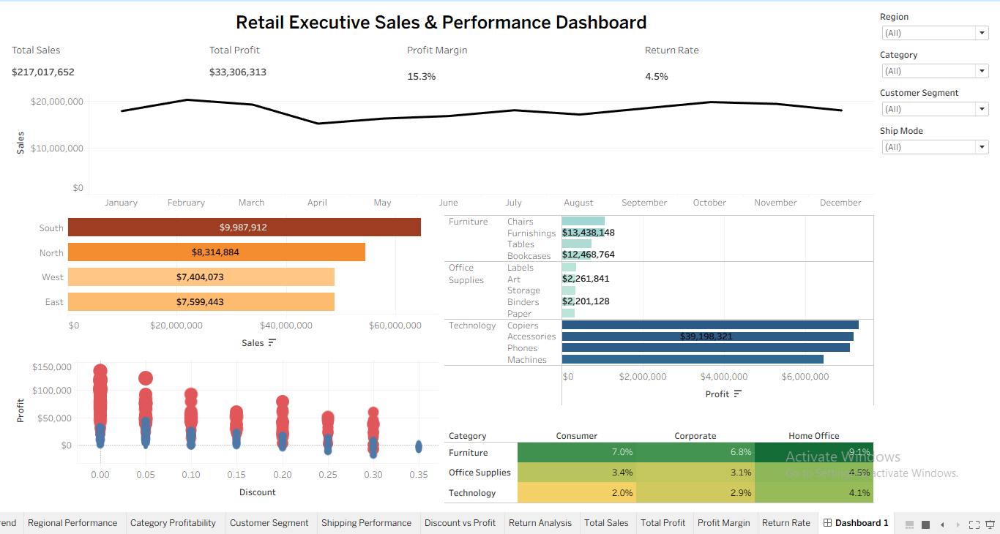
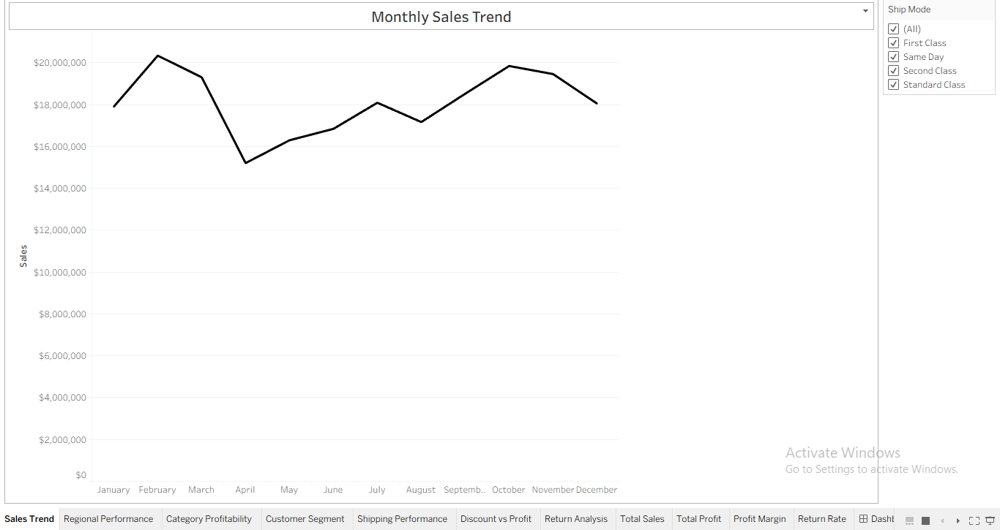
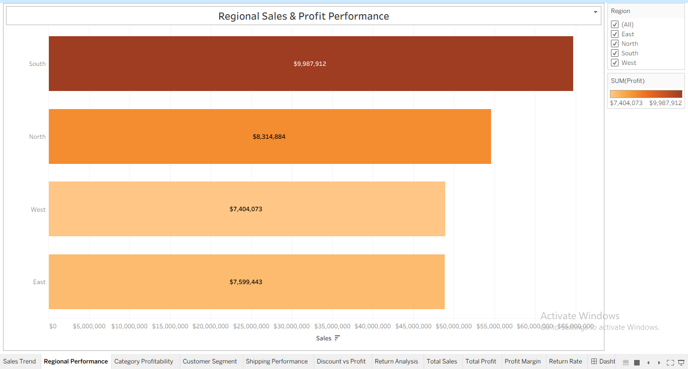
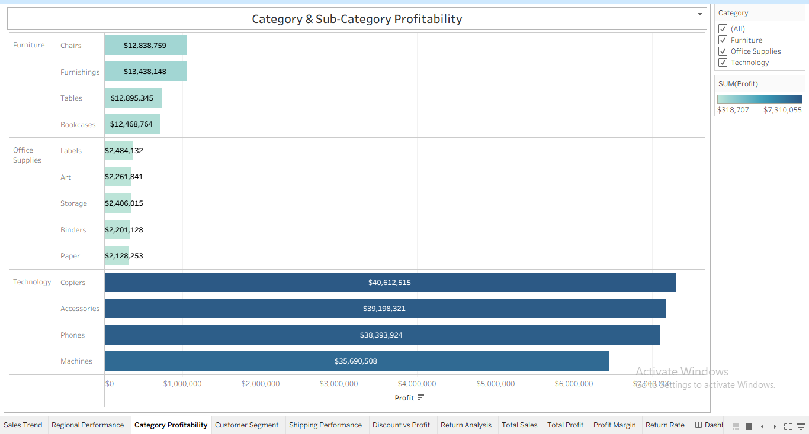
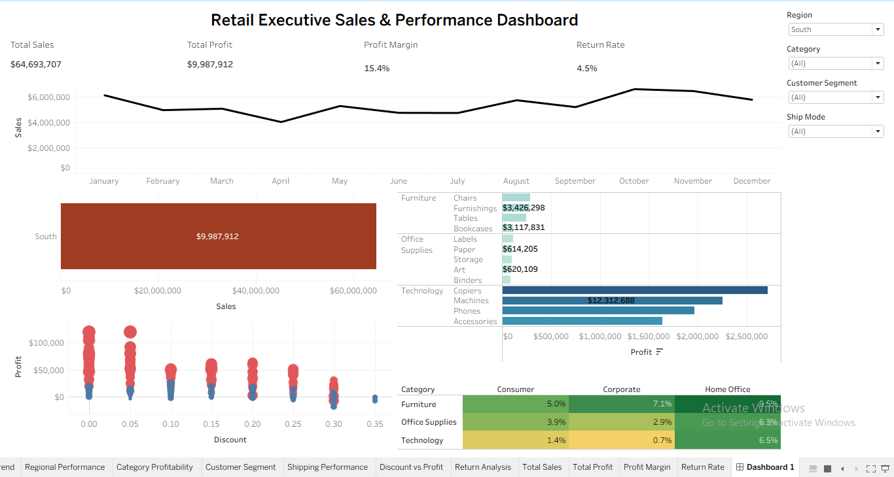

# Retail Executive Sales & Performance Dashboard

## Business Problem Summary

The objective of this project was to design an executive dashboard in Tableau for a retail leadership team. The dashboard enables decision-makers to monitor sales performance, profitability, customer segments, category performance, shipping performance, discount impact, and return patterns. The goal is to identify business opportunities, operational risks, and support data-driven decision-making through interactive visualizations.

---

# Dataset Description

The project uses a retail sales dataset containing transactional information, including:

* Order Date
* Ship Date
* Region
* State
* Category
* Sub-Category
* Customer Segment
* Sales
* Profit
* Discount
* Quantity
* Ship Mode
* Returns
* Order ID

The dataset contains both categorical and numerical variables that were analyzed to evaluate business performance across multiple dimensions.

---

# Tableau Workbook Description

The Tableau workbook contains:

* Data connection and inspection
* Calculated fields
* Individual analytical worksheets
* Executive dashboard
* Interactive filters
* KPI cards
* Dashboard interactions

The dashboard provides leadership with a consolidated view of business performance using multiple visualizations and interactive filtering.

---

# Calculated Fields Created

The following calculated fields were created:

### Profit Margin

```text
SUM([Profit]) / SUM([Sales])
```

Measures the percentage of sales retained as profit.

---

### Cost

```text
SUM([Sales]) - SUM([Profit])
```

Estimates the cost associated with generating sales.

---

### Average Order Value

```text
SUM([Sales]) / COUNTD([Order ID])
```

Calculates the average revenue generated per order.

---

### Return Rate

Calculates the proportion of returned orders relative to the total number of orders.

---

### Shipping Delay Bucket

Categorizes delivery performance into:

* Fast (0–2 Days)
* Standard (3–5 Days)
* Delayed (6+ Days)

---

# Dashboard Components

The executive dashboard includes:

### KPI Cards

* Total Sales
* Total Profit
* Profit Margin
* Return Rate

### Visualizations

* Monthly Sales Trend (Line Chart)
* Regional Performance (Horizontal Bar Chart)
* Category Profitability (Horizontal Bar Chart)
* Discount vs Profit (Scatter Plot)
* Return Analysis (Highlight Table)

---

# Filters and Interactions Used

The dashboard includes interactive filters for:

* Region
* Category
* Customer Segment
* Ship Mode

Users can interact with these filters to dynamically update the dashboard and analyze performance across different business dimensions.

---

# Key Business Insights

Major findings from the dashboard include:

* Sales fluctuate over time, indicating seasonal or demand-driven trends.
* Regional performance varies significantly across markets.
* Product categories differ in profitability despite similar sales levels.
* Customer segments contribute differently to revenue and profit.
* Higher discounts generally reduce profitability.
* Shipping performance varies across shipping modes.
* Return rates differ across products and business segments.
* The dashboard identifies opportunities for improving profitability while reducing operational risks.

---

# Dashboard Story Summary

The dashboard provides executives with a high-level overview of business performance by combining KPIs with detailed visual analysis. It identifies areas of strong performance, highlights operational risks such as excessive discounting and product returns, and supports strategic decision-making through interactive filtering and business-focused visualizations.

---

# Assumptions and Limitations

## Assumptions

* All sales, profit, and return records are accurate and complete.
* Delivery delay is calculated using the difference between Ship Date and Order Date.
* Return information correctly identifies returned orders.
* Profit Margin is calculated as Profit divided by Sales.

## Limitations

* The dashboard is based only on the provided historical dataset.
* External factors such as economic conditions, competitor activity, and seasonality are not included.
* Customer demographics and marketing campaign effectiveness are outside the scope of this analysis.
* No predictive forecasting or advanced statistical analysis is included.

---

# Screenshots Included

## Executive Dashboard



---

## Sales Trend View



---

## Regional Performance View



---

## Category Profitability View



---

## Filter Interaction View


